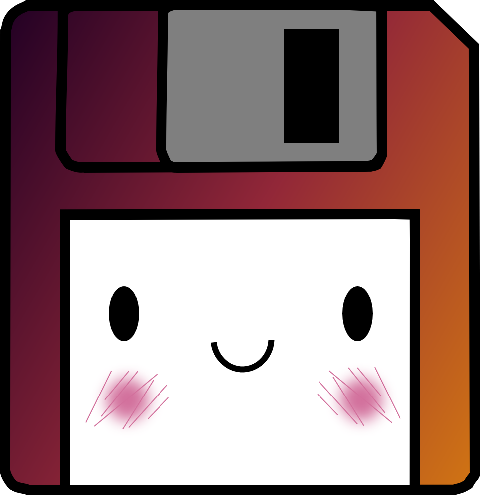

    updated on: 09th August 2025, Saturday

    
    
 Cherishing the past with love 

    

# [Memories](https://memories-pritam.vercel.app)

![line]

## Table of Contents

-   [Introduction](#introduction)
-   [Tech Stack Used](#tech-stack-used)
-   [Preview](#preview)
-   [Demo](#demo)
-   [Designs](#designs)
-   [License](#license)
-   [Best Contributors](#best-contributors)

![line]

## Introduction

-   A modern, fast, and secure web app to store your memories.
-   Built with the latest technologies and best practices.

![line]

## Tech Stack Used

-   Material UI: Styling & Icons
-   Postgres: Database
-   Elysia: Backend Framework
-   Bun: JavaScript Runtime
-   Vercel: Frontend Hosting
-   Render: Backend Hosting
-   Clerk: Authentication

                  

![line]

## Preview

![line]

## Demo

![line]

## Designs

-   

![line]

## Best Contributors

    

![line]

## License

-   see [LICENSE]

**Pritam, 2023**

[license]: https://github.com/warmachine028/memories/blob/main/LICENSE

![line]

### Thank you, everyone! 💚

-   [Memories Old](https://memories-old.vercel.app)
-   [Memories Old - Repository](https://github.com/warmachine028/memories/tree/memories-old)

[line]: https://user-images.githubusercontent.com/75939390/137615281-3a875960-92cc-407f-97fe-fd2319bdb252.png

<!-- 09/08/25 -->
