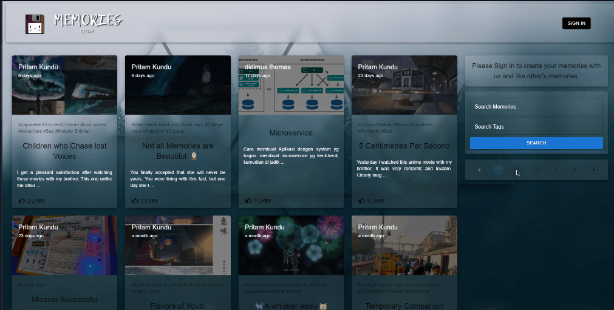
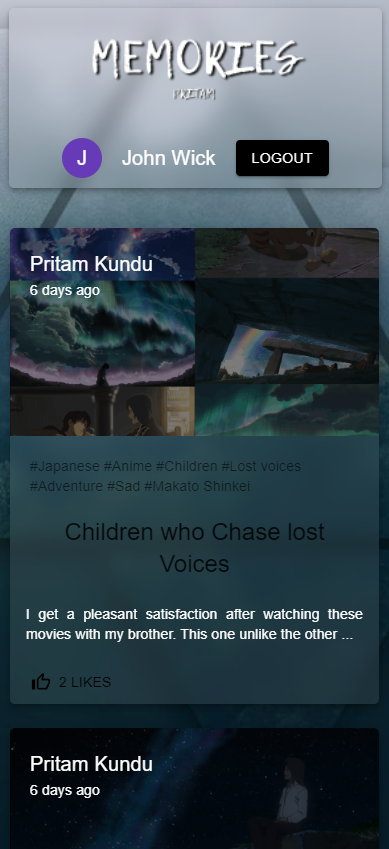
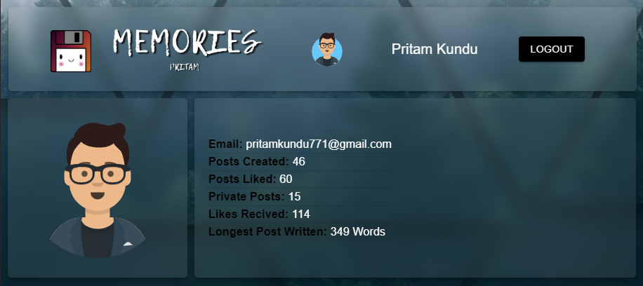
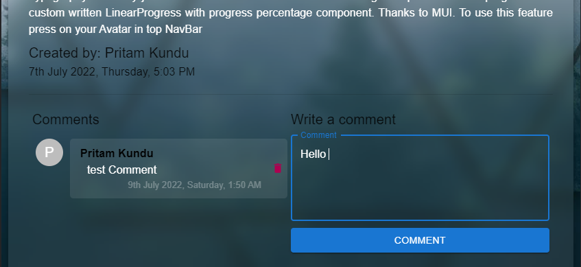
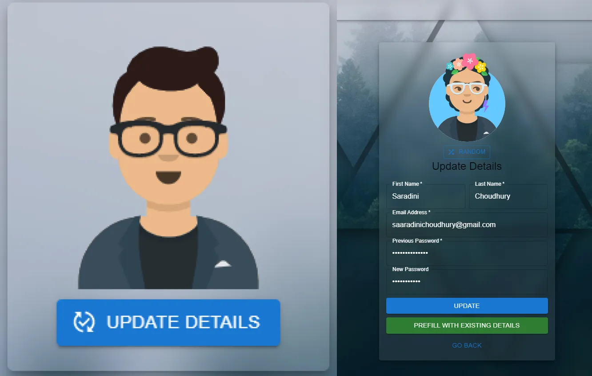
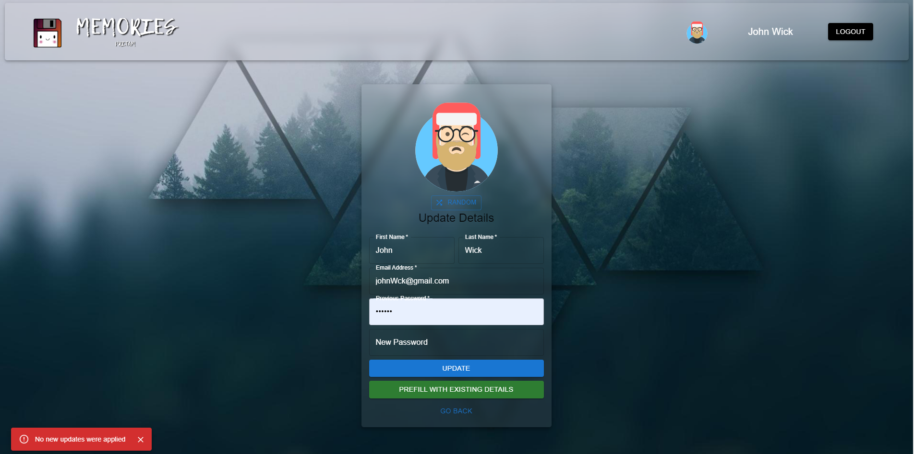

    updated: Thursday, 21st July 2022

    
    
 Cherishing the past with love 

    

# [Memories](https://memories-pritam.netlify.app)

## What's new?

- Added Remember Me and Forgot Password in UI 
- Improved UI By adding Hover animations on post cards and Media 🖼️🌟
- Added Custom Snakbar Alerts from Material UI replacing Basic browser Alerts 💕💕
- Instant Post Update: Now Post Updations take 0 time.
- Fixed CSS for Post, Post Details and Cards for overflowing Text.
- Fixed DeleteComment functionality.
- Fixed noNewUpdates error in userUpdate.
- Seperated CommentSection into new seperate component

## Table of Contents

- [Introduction](#introduction)
- [Acknowledgement](#acknowledgement)
- [Additional Improvements](#additional-improvements)
- [Tech Stack Used](#tech-stack-used)
- [Previews](#previews)
- [Demo](#demo)
- [License](#license)

---

## Introduction

- In earlier days people used to maintain diaries.
- But those days have changed, but our needs still remain the same.
- This is a WebApp helps suffice the need for a digital diary and help improve the user Experience.
- The Anime [Kimi no Na wa](https://en.wikipedia.org/wiki/Your_Name) gave me inspiration to improve this project every bit.

---

## Acknowledgement

- Thanks to JS Mastery for this wonderful tutorial.
- I have added more refined features on top of this project.

---

## Additional Improvements

- Minimalist Look, Translucent Card Type Posts
- CRUD based Operations, Post Search Functionality with Tags
- Details Page of each Post Card, Recommended Posts
- Image Compression (compresses every image under 1MB)
- Like - Comment - Tag functionality and 2 Way Authentication (JWT Token & Google OAuth)
- Randomised Custom User Avatar
- Image Drag and Drop functionality in Preview while creation
- Private Post and Comment Deletion Functionality
- Attention to detail features like comment circular progress, custom Private button gives it the wow factor
- Post Owners and commenters can regulate comments in their posts.
- While deleting comment TrashCan icon turns CircularProgress.
- Comments section only visible if at least 1 comment exist in a post.
- Custom user detail page including newly written dataBase query and Backend Logic.
- Custom Posts Liked by user Component.
- Customised comment containers with User avatar and post times.
- Clickable Chips and Custom Tabs in UserDetails page.
- Memories is now a Progressive Web App 🎉🎉🎊🎊.
- Added Credential Update Feature for users.

## Tech Stack Used

- Material UI: Styling & Icons
- MongoDB: For DataBase Management
- ExpressJs: For BackEnd Routing
- React: FrontEnd Developement
- NodeJS: For BackEnd developement
- Netlify: For hosting the frontEnd developement
- Vercel: For hosting the frontent production
- Heroku: Hosting the backEnd

   
   
  
 
---

## Previews

- Desktop Preview

- Mobile Preview

- User Details:

- Comment:

- Credential Update:

- SnackBar Alerts

- Remember Me and Forgot Password

---

## Demo

---

## Upcomming

- Migrating from OAuth 1.0 to OAuth 2.0 to avoid deprication
- Implement Remember Me Feature in Authentication

---

## License

- see [LICENSE]

**Pritam, 2022**

[license]: https://github.com/warmachine028/memories/blob/main/LICENSE
